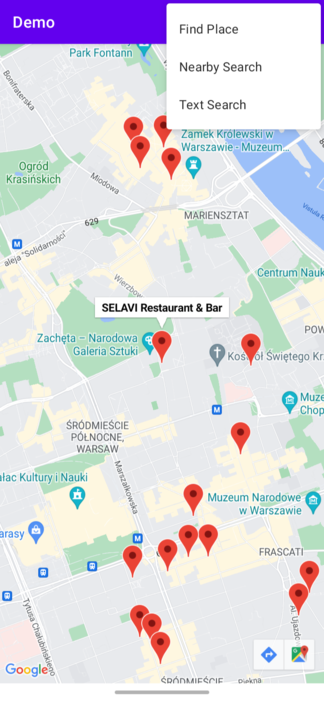

[](https://search.maven.org/artifact/com.urmich.android/placesearch-ktx)
[](https://jitpack.io/#urmichm/places-placesearch-ktx)


Places | Place Search KTX
==================

## Description 
This repository contains Kotlin extensions (KTX) for:
1. The [Places SDK for Android][places-sdk]

It enables you to use [Place Search][place-search] API.

## Requirements
* API level 18+
* Places SDK through Google Play Services

## Installation

In order to use the library, include the following dependency:
```gradle
dependencies {
      implementation 'com.urmich.android:placesearch-ktx:1.0.0'
 }
```

The result of the API call can be converted into a set of [Place][place] objects.
Such conversion accelerates the usage of Place Search and integrates the package into Place Details SDK.
Do not forget to have Google Places library included. 

```gradle
dependencies {
    implementation 'com.google.android.libraries.places:places:2.6.0'
}
```
Update the `local.properties` file in your root directory (Note: this file should *NOT* be
under version control to protect your API key) and add a single line to `local.properties` that
looks like `PLACES_API_KEY="YOUR_API_KEY"`, where `YOUR_API_KEY` is the API key you obtained in
the first step. You can also take a look at the [local.defaults.properties](local.defaults.properties)
as an example. This is the same key you created to use [Places SDK][places-sdk].



### Demo App
A [demo](app) application is contained within this repository that illustrates the use of this KTX library.

To run the demo app, you'll have to:

1. [Get a Places API key][api-key]
2. Update the `local.properties` file in your root directory and add lines to `local.properties` that
looks like `PLACES_API_KEY="YOUR_API_KEY"` and `MAPS_API_KEY="YOUR_MAPS_API_KEY"`.
 * `YOUR_API_KEY` is the API key you obtained in the first step. It is the same key you use to access Places SDK.
 * `YOUR_MAPS_API_KEY` is the key to the use google map. 
You can also take a look at the [local.defaults.properties](local.defaults.properties) as an example.
3. Build and run    

## Support

Encounter an issue while using this library?

If you find a bug or have a feature request, please [file an issue][file-an-issue].
Or, if you'd like to contribute, send us a [Pull Request][pull-request].

For more information, check out the detailed guide on the
[Google Developers site][places-sdk].


[file-an-issue]: https://github.com/urmichm/places-placesearch-ktx/issues/new
[pull-request]: https://github.com/urmichm/places-placesearch-ktx/compare

[api-key]: https://developers.google.com/places/android-sdk/get-api-key
[place]: https://developers.google.com/maps/documentation/places/android-sdk/reference/com/google/android/libraries/places/api/model/Place
[places-sdk]: https://developers.google.com/maps/documentation/places/android-sdk/overview
[place-search]: https://developers.google.com/maps/documentation/places/web-service/search
